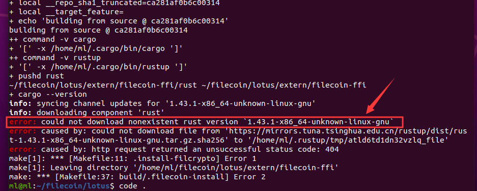

## [回目录](./README.md)

## 12 编译相关问题

### 12.1 crate.io 源的问题

如果因为编译的时候卡住，症状如下图所示：


解决方法：可以试试更改 `crate.io` 的源为国内的源，例如：

```sh
# 上海交通大学（正常使用）
[source.crates-io]
replace-with = 'sjtu'
[source.sjtu]
registry = "https://mirrors.sjtug.sjtu.edu.cn/git/crates.io-index"

# 清华的源（失效）
[source.crates-io]
replace-with = 'tuna'
[source.tuna]
registry = "https://mirrors.tuna.tsinghua.edu.cn/git/crates.io-index.git"

# rustcc社区
[source.crates-io]
replace-with = 'rustcc'
[source.rustcc]
registry = "git://crates.rustcc.cn/crates.io-index"

```
使用方法：`vi ~/.cargo/config`， 然后把以上中的任意一个添加进去，保存好，然后再重新编译一次即可。
[参考](https://blog.csdn.net/xiangxianghehe/article/details/105874880)

### 12.2 GOPROXY 的问题

如果在编译的时候因为下载代码子模块的时候卡住（GO 代码），可能是 GOPROXY 没有设置，此时，设置一下 GOPROXY，然后再重新编译一遍即可：

```sh
export GOPROXY=https://goproxy.cn
```
### 12.3 go 版本太低的问题

lotus 的 interopnet 分支在编译的时候，如果检测到 go 的版本低于 1.14， 则会编译失败，如下图所示：


解决方法，安装新版本的 go，并软链接 `/usr/bin/go` 到新版的 go 可执行文件中（或者卸载旧版的 go）：

```sh
# Ubuntu 20.04 示例
sudo apt install golang-1.14
# 删除原来的 go 软链接
sudo rm /usr/bin/go
# 让它链接到新版本的 go 可执行文件中
sudo ln -s /usr/lib/go-1.14/bin/go /usr/bin/go
```

### 12.4 编译提示 Rustup 1.43.1 版本找不到

在编译最新版的 master 分支分支的时候遇到这个问题（2020年6月19号23点，master 的 commit 是： ffa7be86fe6ee738ab4b095469029b9fac51e090），编译的时候提示找不到 `1.43.1-x86_64-unknown-linux-gnu` ，错误信息如下所示：



解决方法是跳过这个版本，直接使用 `nightly` 的版本，即，替换以下这个文件中的 `1.43.1` 为 `nightly`。

```sh
echo "nightly" > ./extern/filecoin-ffi/rust/rust-toolchain
```

然后再重新编译，即可正常编译。

### 12.5 Intel 机器 【SIGILL: illegal instruction】

使用 Intel （老）机器，调试本地测试网测试 2KiB 扇区，执行 `lotus-seed` 命令的时候出现程序崩溃现象：

```sh
./lotus-seed genesis add-miner localnet.json ~/.genesis-sectors/pre-seal-t01000.json
```
错误信息大致如下所示：

```sh
SIGILL: illegal instruction
PC=0xe910af m=4 sigcode=2

goroutine 0 [idle]:
runtime: unknown pc 0xe910af
stack: frame={sp:0x7efc33ec4830, fp:0x0} stack=[0x7efc336c4ec8,0x7efc33ec4ac8)
00007efc33ec4730:  0000000003ed46a0  000000000063e394 <path/filepath.walkSymlinks+660> 
00007efc33ec4740:  0000000000000000  0000000000000000 
00007efc33ec4750:  0000000000000000  0000000000000000 
......
goroutine 1 [syscall]:
runtime.cgocall(0xe7a700, 0xc0009b77c8, 0x6cb501)
	/usr/lib/go-1.14/src/runtime/cgocall.go:133 +0x5b fp=0xc0009b7798 sp=0xc0009b7760 pc=0x51b75b
github.com/supranational/blst/bindings/go._Cfunc_blst_keygen(0xc000156320, 0xc0001562c0, 0x20, 0x0, 0x0)
	_cgo_gotypes.go:298 +0x45 fp=0xc0009b77c8 sp=0xc0009b7798 pc=0xe61505
github.com/supranational/blst/bindings/go.KeyGen(0xc0001562c0, 0x20, 0x20, 0x0, 0x0, 0x0, 0x6882897a)
	/home/ml/filecoin/official/lotus/extern/fil-blst/blst/bindings/go/blst.go:79 +0x96 fp=0xc0009b7808 sp=0xc0009b77c8 pc=0xe63596
github.com/filecoin-project/lotus/lib/sigs/bls.blsSigner.GenPrivate(0xc000542468, 0xc39cc8db33e69201, 0xc300000000000008, 0x0, 0xc000542460)
	/home/ml/filecoin/official/lotus/lib/sigs/bls/init.go:32 +0xeb fp=0xc0009b7868 sp=0xc0009b7808 pc=0xe6c98b
......
```

**解决方法：** 编译的时候加上参数 `CGO_CFLAGS="-D__BLST_PORTABLE__"`：

```sh
FFI_BUILD_FROM_SOURCE=1 CGO_CFLAGS="-D__BLST_PORTABLE__" make clean debug
```

参考：[【lotus/issues/4059】](https://github.com/filecoin-project/lotus/issues/4059)

### 12.6 编译错误：Unable to find libclang

新版的 lotus 需要用到 clang 编译器来编译部分底层的代码，因此，如果系统上没有安装 clang 的话，在编译 lotus 的时候就会报错，错误信息如下所示：

```sh
cargo:rustc-link-lib=stdc++
cargo:warning=couldn't execute `llvm-config --prefix` (error: No such file or directory (os error 2))
cargo:warning=set the LLVM_CONFIG_PATH environment variable to the full path to a valid `llvm-config` executable (including the executable itself)

--- stderr
thread 'main' panicked at 'Unable to find libclang: "couldn\'t find any valid shared libraries matching: [\'libclang.so\', \'libclang-*.so\', \'libclang.so.*\', \'libclang-*.so.*\'], set the `LIBCLANG_PATH` environment variable to a path where one of these files can be found (invalid: [])"', /home/ml/.cargo/registry/src/mirrors.tuna.tsinghua.edu.cn-df7c3c540f42cdbd/bindgen-0.54.0/src/lib.rs:1959:13
note: run with `RUST_BACKTRACE=1` environment variable to display a backtrace

warning: build failed, waiting for other jobs to finish...
error: build failed
+ rm -f /tmp/tmp.npUjYGfyHa
Makefile:11: recipe for target '.install-filcrypto' failed
make[1]: *** [.install-filcrypto] Error 101
make[1]: Leaving directory '/home/ml/filecoin/official/lotus/extern/filecoin-ffi'
```

**解决方法：** 编译之前先安装 clang：

```sh
# 安装 clang
sudo apt install clang
# 或者
# sudo apt install clang-10
# 出问题可以试一下（在 Ubuntu 18.04 上安装 clang-10 的时候可能会需要加上【--fix-missing】参数）：
# sudo apt install clang-10 --fix-missing

# 然后再重新编译
FFI_BUILD_FROM_SOURCE=1 make all
```
参考：[【lotus/issues/3826】](https://github.com/filecoin-project/lotus/issues/3826)


### 12.7 Ulimit 问题：Too many open files (os error 24)

miner 在运行过程中可能会出现这个错误 `Too many open files (os error 24)`， 导致程序退出，解决的方法就是设置系统中最大允许的文件打开数量：

`ulimit` 命令分别可以作用于 `soft` 类型和 `hard` 类型，`soft` 表示可以超出，但只是警告
`hard` 表示绝对不能超出，两者的值一般是不一样的:

```sh
# 查看当前值（默认是 soft 值）：
ulimit -a | grep -ni "open"
# 查看当前值 soft 值：
ulimit -Sa | grep -ni "open"
# 查看当前值 hard 值：
ulimit -Ha | grep -ni "open"

# 临时修改（只对当前 Shell 有用，修改立即生效）：
# 修改为 1048576 （默认修改的是 soft 值）：
ulimit -n 1048576  # 等效于 ulimit -Sn 1048576
# 临时修改 hard 值为 1048576
ulimit -Hn 1048576
# 可同时修改 soft 和 hard 的值：
ulimit -SHn 1048576

# 针对正在运行中的miner进程，可以通过以下命令修改：
prlimit --pid <PID> --nofile=1048576:1048576
# 通过以下命令查看修改：
cat /proc/<PID>/limits

# 永久修改（重新登录或重启生效）: 
# 把文件 /etc/systemd/user.conf  和 /etc/systemd/system.conf 中的字段修改如下：
DefaultLimitNOFILE=1048576
# 并修改 /etc/security/limits.conf 文件，添加如下内容：
* hard nofile 1048576
* soft nofile 1048576
```

Ref: [【解决Too many open files问题】](https://blog.csdn.net/zgaoq/article/details/81911860)、[【Too many open files的四种解决办法】](https://www.cnblogs.com/huaweicloud/p/11861475.html)

### 12.8 daemon 无法启动时恢复钱包密钥的方法

由于某种原因，可能由于 `.lotus` 目录下的某些文件损坏导致 `lotus daemon` 无法启动，此时，最关键的还是要先把钱包的密钥导出来备份好（如果之前有备份的话就可以不用往下看了），导出的方法如下所示：

假设出故障的机器叫做 `机器A`，新的机器叫做 `机器B`：

- (1). 在 `机器B` 上启动一个干净的 `daemon` 进程（同一台机器上也行，但是要保证有一个新的 `.lotus` 目录，和旧 `.lotus` 目录不能冲突），启动之后，`daemon` 会自动创建一个新的 `.lotus` 目录
- (2). 关闭 `机器B` 上的 `daemon` 进程，删除 `机器B` 上的 `.lotus` 目录中的 `token` 文件和 `keystore` 文件夹。
- (3). 拷贝 `机器A` 上的 `.lotus` 目录中的 `token` 文件和 `keystore` 文件夹到 `机器B` 的 `.lotus` 目录中
- (4). 再次启动 `机器B` 中的 daemon，此时就可以在 `机器B` 中正常的导出钱包地址了

### 12.9 链同步错误：block was from the future

同步链错误，由于本机的时间与网络时间不同步导致，解决方法如下所示：

```sh
# 同步本机时间
ntpdate ntp.aliyun.com
```

### 12.10 编译错误：/usr/bin/ld: cannot find -lhwloc

hwloc 是获取 CPU 硬件信息的有用工具，lotus 需要使用到这个工具，安装一下就可以：

```sh
# Ubuntu 上的解决方法：
sudo apt install hwloc libhwloc-dev
```
[参考](https://github.com/daschl/hwloc-rs/issues/23) 

### 12.11 编译错误：git@github.com: Permission denied (publickey)

给自己的 github 添加一对公私钥就可以了，生成公私钥对的命令参考如下，生成之后，你还需要把公钥复制到 github 账号的 `SSH Keys` 中（这步需要在网页上操作），默认生成的公钥名称是 `id_rsa.pub`, 私钥名称是 `id_rsa`，私钥放在你的 `~/.ssh` 文件夹中即可，公钥上传到 github 服务器中：

```sh
# 生成公私钥对，带 .pub 后缀的文件是公钥，是需要上传到 github 上面的
# 命令中 【your_email@email.com】 输入你的 github 账号
ssh-keygen -t rsa -C "your_email@email.com"
```

[参考](https://blog.csdn.net/fenghuibian/article/details/73350890)

### 12.12 同步错误：Error: chain contained block marked previously as bad

例如，当前链同步的高度是 6100，但是同步的时候出现某个块是坏块，因此，会导致同步失败，失败信息如下所示：

```sh
Error: chain linked to block marked previously as bad ([bafy2bzacedwp2ciwsjirnxc5gdtehddjurpp7qijzal32su7ob5vh4ons2sm2],
```

解决方法：先把高度往前调一些（比如，当前高度在 6100， 往前调到 6000），然后再手动标记某些坏块：

```sh
lotus chain sethead --epoch 6000
# 重启一下 daemon
lotus sync mark-bad bafy2bzacedwp2ciwsjirnxc5gdtehddjurpp7qijzal32su7ob5vh4ons2sm2
```

[参考](https://filecoinproject.slack.com/archives/CPFTWMY7N/p1593170480169100)

### 12.13 编译 lotus 1.2.1 失败：Update Golang to version to at least 1.15.5

最新版 `lotus-v1.2.1` 需要使用最新版的 `golang` (`golang-1.15.5`) 来编译，否则会如下错误：

```sh
Makefile:10: Your Golang version is go 1.15.2
Makefile:11: *** Update Golang to version to at least 1.15.5.  Stop.
```

目前在 `Ubuntu 20.04` 上可以直接使用 `apt` 安装最新版的 `golang` （安装新版 `golang` 之前最好先卸载旧版的，否则可能会出问题），如果是使用 `Ubuntu 18.04`，则需要手动下载 `golang` 手动安装：

- 下载地址：[【https://golang.org/dl/】](https://golang.org/dl/)， 或者[【go1.15.5.linux-amd64.tar.gz】](https://golang.org/dl/go1.15.5.linux-amd64.tar.gz)，

- 安装方式：[【https://golang.org/doc/install#install】](https://golang.org/doc/install#install)

安装参考命令：

```sh
tar -C /usr/local -xzf go1.15.5.linux-amd64.tar.gz
vi ~/.bashrc
# 在 ~/.bashrc 文件的末尾加上： export PATH=$PATH:/usr/local/go/bin
source ~/.bashrc
```

## [回目录](./README.md)