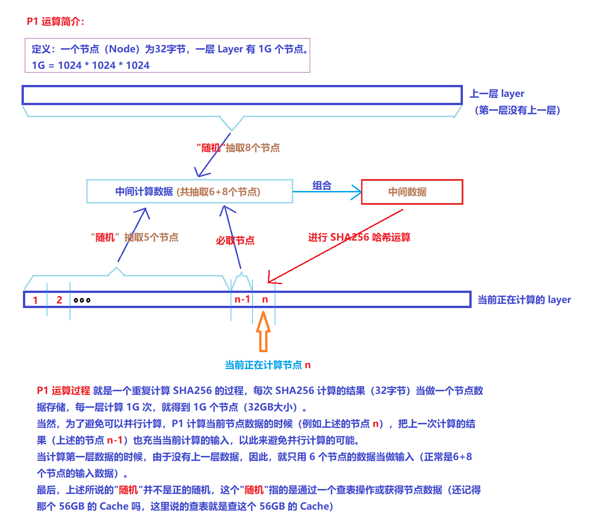
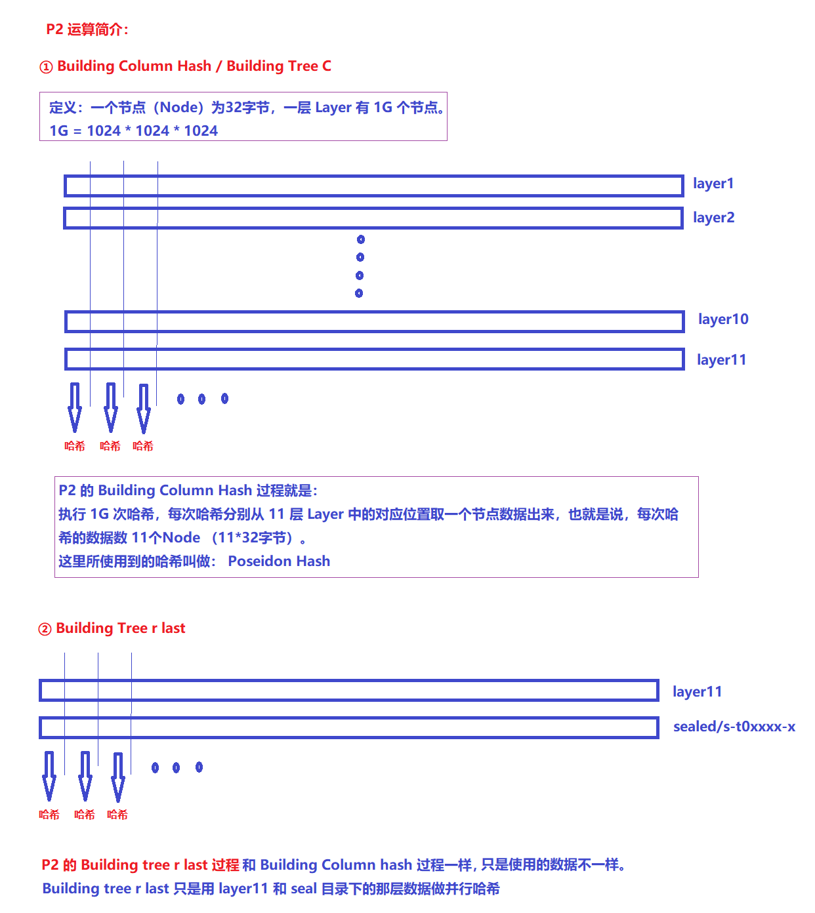

## [回目录](./README.md)

## 16 Seal 密封流程

### 16.1 P1 计算过程简介

对于 `32GB` 的扇区，P1 计算过程是生成 11 层数据，每层数据都是 `32GB` 大小，并且除了第一层之外，剩下的 10 层数据的生成过程是完全一样的。
这里涉及到一个节点的概念，其实就是把一个 32 字节的数据当做一个节点，一层 Layer 由 `1G`（`1G=1024*1024*1024`） 个连续的节点组成，仅此而已。

### 16.2 P2 计算过程简介

P2 的运算过程其实也很简单，只是使用的哈希算法是 `Poseidon` 哈希算法而已，本质上还是进行哈希运算。
P2 分为两个阶段，一个是 `Building column hash`（也叫做 `Building tree c`），另一个叫做 `Building tree r last`。
只不过，在 `Building column hash` 的时候，会把每层的 `1G` 个节点的划分为大小相等的 `8` 份，每一份都是 `128M` 个节点，最后生成一个 8 个 `tree-c`（`tree-c-0` ~ `tree-c-7`）（下图为了简洁，没有体现划分 8 份的操作）。
`Building tree r last` 和  `Building column hash` 基本一样，只是使用的数据不一样罢了，最后生成 `tree-r-last-0` ~ `tree-r-last-7`。

## [回目录](./README.md)