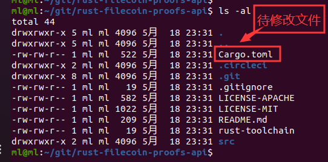
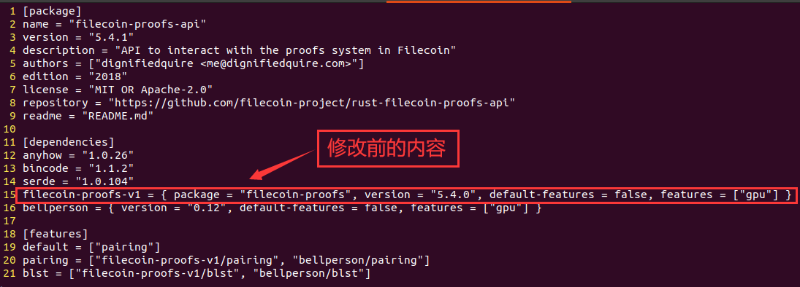

# GDB 调试 lotus 源码教程

## 1. 环境配置

### (1). 下载源代码

这里所说的源代码不仅包括 lotus 的源代码： [lotus](https://github.com/filecoin-project/lotus)，还包括底层 rust 库实现的代码： [rust-fil-proofs](https://github.com/filecoin-project/rust-fil-proofs)，以及中间一层 封装接口调用的代码： [rust-filecoin-proofs-api](https://github.com/filecoin-project/rust-filecoin-proofs-api)，这里的三份代码的关系是这样的：`lotus` 调用 `rust-filecoin-proofs-api` 的 `api` 接口，而  `rust-filecoin-proofs-api` 是对底层 `rust-fil-proofs` 的一个简单封装,所以我们需要把这三个项目的代码都下载下来。

假设我们现在所在目录是 `~/git/`，然后在该目录中把所有代码都下载下来：

```sh
cd ~/git/
git clone https://github.com/filecoin-project/lotus.git
git clone https://github.com/filecoin-project/rust-fil-proofs.git
git clone https://github.com/filecoin-project/rust-filecoin-proofs-api.git
```

下载之后就可以看到这三个项目的代码了：


### (2). 配置源代码

下载下来之后， `~/git/` 目录中就有这三个项目的代码，而 `lotus` 本身默认使用的底层库代码不是我们放在 `~/git/` 目录下的代码，为了让它使用我们 `~/git/` 目录下底层库代码（方便后续修改代码，然后重新编译），我们需要对这项目中的配置文件做一些修改（改它们的 **Cargo.toml** 配置文件）。

**注意：**
待修改配置文件的项目有两个：`lotus` 和  `rust-filecoin-proofs-api` ，而 `rust-fil-proofs` **无需做任何修改**。

#### A. 修改 lotus 中的配置文件

首先修改 `lotus` 目录中的 **Cargo.toml** 配置文件，让它直接使用本地的 `rust-filecoin-proofs-api` 代码，这个配置文件的路径在：`lotus/extern/filecoin-ffi/rust/` 目录下，但是由于第一次使用这份代码，这个目录还不存在，因此，可以先编译一遍这个 `lotus` 的源码，让它先生成这个对应的目录，以及其中的相关代码，编译命令如下（**FFI_BUILD_FROM_SOURCE=1** 这个环境变量是必须的）：

```sh
FFI_BUILD_FROM_SOURCE=1 make clean debug
```

这里只是预编译，就是为了获取 `lotus/extern/filecoin-ffi/` 目录下的源码就可以了，如下图所示（当然你也可以直接从已有的项目中拷贝对应的代码过来）：


有了对应的代码，就可以修改对应的 **Cargo.toml** 文件了：


**修改前：**


**修改后：**


注意，上述修改中，原来用 **git** 关键字的，现在用的是 **path** 关键字，以及把下一行的 `branch="master"` 删除。


#### B. 修改 rust-filecoin-proofs-api 中的配置文件

`rust-filecoin-proofs-api` 中也需要修改对应的 **Cargo.toml** 文件，让它使用本地的 `rust-filecoin-proofs` 库中的代码：



**修改前：**



**修改后：**


**这里要特别注意那个尾巴，是必须要加上去的，否则无法编译。**


## 2. 编译前的准备

### (1). 编译 Debug 版本代码

经过第一节的修改配置之后，其实已经可以正常编译了，并且使用的是本地的 rust 库代码，可以自己修改 rust 库代码，然后实现一些优化、定制等工作。

但是，我们现在的目的不但是为了能够方便的修改并使用本地的代码，有时候还需要进行运行时的观察、进行动态调试等，这在程序开发过程中是不可获取的一步。因此，我们把这个 rust 库和 lotus 都编译成带符号的可执行文件，也就是 Debug 版本，然后就方便我们动态调试和单步调试。

要把底层的 rust 库和上层的 go 实现的代码编译成 Debug 版本，需要修改以下三个配置文件：

- ~/git/lotus/Makefile
- ~/git/lotus/extern/filecoin-ffi/install-filcrypto
- ~/git/lotus/extern/filecoin-ffi/rust/scripts/build-release.sh

#### A. 修改 Makefile 文件

Makefile 中要把 `bench` 模块加入到 Debug 组，这样的话，我们执行 `FFI_BUILD_FROM_SOURCE=1 make clean debug` 命令的时候就能够把 `bench` 程序的 Debug 版本也编译出来（默认 `bench` 程序没有 Debug 版本的），修改结果如下：


当然，你也可以在 `2k` 后面加上 `bench` 程序，这样我们就可以编译出 Debug 版本的 `bench` 程序，方便调试。

#### B. 修改 install-filcrypto 文件

这个 install-filcrypto 文件是用来安装底层 rust 库的时候用到的，因此，也需要修改它，让它指向 Debug 版本中的内容，使用 Debug 版本中的底层库来构建上层的 lotus，修改部分如下：


#### C. 修改 build-release.sh 文件

这个文件就涉及到编译底层 rust 库是使用到的编译变量（比如 CFLAG 等），主要是把该文件中的 `--release` 字段去掉，这样编译出来的底层 rust 库就是 Debug 版本的，就带有源代码的符号信息，就可以使用 GDB 来跟住源代码单步调试，修改内容如下：


好了，通过以上三个文件的修改，现在已经可以编译出一个 Debug 版本的 lotus 和 底层 rust 库了，最后就差一个改进版的 GDB 了。

### (2). 配置 GDB

Linux 中原生的 GDB 其实是比较难用的，我们一般都会对它做一些增强，使得我们用起来更加顺手，增强的方式一般是给 GDB 添加对应的插件，我们常用的插件包括 [**GEF**](https://github.com/hugsy/gef)、[**Peda**](https://github.com/longld/peda) 等，在这篇文章中，我们使用 **GEF**，当然，你要用啥有你自己决定。

本文中，我对 GEF 做了一些改进，使得我们用起来体验感更好，我自己修改过的 GEF 在 [**这里**](./files/.gdbinit-gef.py)，使用的方式是把这个跟文件下载到你的 home 目录下，然后在 home 目录下执行以下命令使 GEF 生效：

```sh
echo source "~/.gdbinit-gef.py" >> ~/.gdbinit
```

## 3. 编译并单步调试


